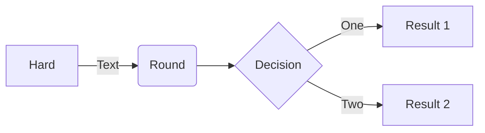

# 这是一级标题
## 这是二级标题
### 这是三级标题
#### 这是四级标题
这也可以是标题
---

```
这是围栏代码块
可以多行
```
试试`代码块`
*这是斜体Italic*
**这是粗体Bold**
***这是斜体加粗体***
这是一行文本
这是第二行文本   
这是前半句    这是后半句
> 这是块引用
> 这是连续的块
> 
> 中间空一行
> > 块的嵌套


* 星号（asterisk）这是列表
* 连续的列表
    * 二级列表
    * 😆
- 减号(minus sign)是列表
+ 加号(plus sign)也是列表
****
这是分割线

--------
这也是分割线
————————这也可以伪装分割线
————————————————~~删除线~~————————————————————————
[这是一个链接](https://markdown.com.cn/basic-syntax/links.html "makedown语法教程")


这是可以点击的链接
<https://markdown.com.cn/basic-syntax/links.html>
**[链接](https://markdown.com.cn/basic-syntax/links.html)** 也可以带格式
[链接][web]的引用
*****

> 试试图片
> 这是一张图片


> 这是带链接的图片

[](https://markdown.com.cn/basic-syntax/links.html)

****

试试脚注功能[^1^],可以进行引用[^2^],脚注会自动到最下面

[web]: <https://markdown.com.cn/basic-syntax/links.html> "makedown语法教程"

[^1^]:这是脚注1
[^2^]: <https://markdown.com.cn/basic-syntax/links.html>
****
> 试试表格
> 有网的话可以用这个[网站](https://www.tablesgenerator.com/markdown_tables)


| Syntax      | Description |
| ----------- | ----------- |
| Header      | Title       |
| Paragraph   | Text        |


::: tip 标题
内容
:::


